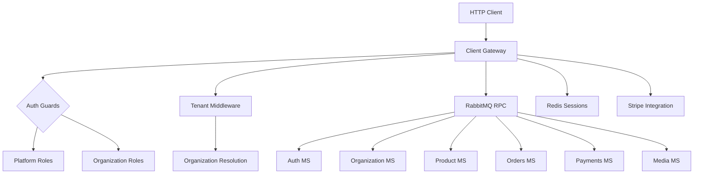

# 🧩 Client Gateway Microservice

The Client Gateway is a production-ready API Gateway microservice built with NestJS for a multi-tenant e-commerce SaaS platform called Binou. It serves as the single entry point for all client requests, handling authentication, authorization, and business logic coordination across multiple backend microservices. The service supports dual authentication contexts (SaaS platform users and end customers) with role-based access control at both platform and organization levels.

## 🏗️ Architecture

The service follows a layered architecture with clear domain boundaries:

- **Controllers Layer**: HTTP endpoints with Swagger documentation
- **Services Layer**: Business logic and RabbitMQ RPC calls
- **Common Layer**: Shared utilities, guards, decorators, and middleware
- **Transports Layer**: RabbitMQ and Redis providers

It implements Domain-Driven Design with separate domains for SaaS users, customers, organizations, products, orders, payments, and media. Multi-tenant isolation is achieved through tenant middleware that resolves organization IDs from headers or domain names.



## ⚙️ Tech Stack

| Category | Technology | Version |
|----------|-----------|---------|
| **Runtime** | Node.js | ^22.19.11 |
| **Framework** | NestJS | ^11.0.1 |
| **Language** | TypeScript | ^5.7.3 |
| **Validation** | class-validator, class-transformer | ^0.14.2, ^0.5.1 |
| **Schema Validation** | Zod | ^3.25.76 |
| **JWT** | @nestjs/jwt | ^11.0.0 |
| **Message Queue** | amqplib, amqp-connection-manager | ^0.10.9, ^4.1.14 |
| **Cache** | ioredis | ^5.8.0 |
| **Payments** | stripe | ^20.3.1 |
| **Testing** | Jest | ^29.7.0 |
| **API Docs** | @nestjs/swagger | ^11.2.5 |

## 📁 Project Structure

```
src/
├── app.module.ts                 # Root module importing all features
├── main.ts                       # Application bootstrap
├── common/                       # Shared utilities and cross-cutting concerns
│   ├── decorators/               # Custom decorators for auth and swagger
│   ├── guards/                   # Authentication and authorization guards
│   ├── middleware/               # Tenant resolution middleware
│   ├── enums/                    # Platform and organization roles
│   ├── exceptions/               # RPC error handling filter
│   ├── interfaces/               # Type definitions and contracts
│   ├── services/                 # Base CRUD service
│   └── dto/                      # Shared DTOs
├── config/                       # Environment configuration and service names
├── transports/                   # RabbitMQ module
├── redis/                        # Redis provider
├── auth-ms/                      # Authentication gateway
│   ├── saas-auth/                # SaaS user authentication
│   └── customer-auth/            # Customer authentication
├── organization-ms/              # Organization management
├── product-ms/                   # Product catalog management
├── orders-ms/                    # Order processing
├── payments-ms/                  # Payment and subscription handling
└── media-ms/                     # File upload management
```

## 🔌 Environment Variables

All environment variables are validated using Zod schema:

| Variable | Type | Default | Description |
|----------|------|---------|-------------|
| `PORT` | number | 4000 | Server port |
| `FRONT_URL` | string | - | Frontend URL for Stripe redirects |
| `JWT_SECRET_ACCESS` | string | - | JWT secret for token signing |
| `RABBITMQ_URL` | string | - | RabbitMQ connection URL |
| `STRIPE_WEBHOOK_SECRET` | string | - | Stripe platform webhook secret |
| `STRIPE_CONNECT_WEBHOOK_SECRET` | string | - | Stripe Connect webhook secret |
| `STRIPE_SECRET` | string | - | Stripe API secret key |
| `RABBITMQ_QUEUE` | string | - | Primary RabbitMQ queue |
| `RABBITMQ_QUEUE_EVENTS_PAYMENTS` | string | - | Payment events queue |
| `RMQ_EVENTS_QUEUE_ORGANIZATION` | string | - | Organization events queue |
| `REDIS_HOST` | string | - | Redis server hostname |
| `REDIS_PORT` | number | 6379 | Redis server port |

## 🚀 Installation & Running

### Prerequisites
- Node.js ^22.19.11
- RabbitMQ server
- Redis server
- Stripe account

### Installation
```bash
npm install
```

### Development
```bash
npm run start:dev
```

### Production
```bash
npm run build
npm run start:prod
```

### Docker
```bash
docker build -t client-gateway .
docker run -p 4000:4000 client-gateway
```

## 📡 API Endpoints

### Authentication - SaaS Users
| Method | Route | Guards | Description |
|--------|-------|--------|-------------|
| POST | `/saas/users/register` | - | Register new SaaS user |
| POST | `/saas/users/login` | - | Login SaaS user |
| POST | `/saas/users/logout` | AuthSessionGuard | Logout and invalidate session |
| POST | `/saas/users/logout-all` | AuthSessionGuard | Logout all sessions |
| POST | `/saas/users/refresh` | - | Refresh access token |
| POST | `/saas/users/forgot-password` | - | Request password reset |
| POST | `/saas/users/reset-password` | - | Reset password with token |
| POST | `/saas/users/google-auth` | - | Google OAuth login |
| GET | `/saas/users/me` | AuthSessionGuard | Get profile |
| PATCH | `/saas/users/me` | AuthSessionGuard | Update profile |
| PATCH | `/saas/users/me/password` | AuthSessionGuard | Change password |
| PATCH | `/saas/users/me/deactivate` | AuthSessionGuard | Deactivate account |
| PATCH | `/saas/users/me/reactivate` | AuthSessionGuard | Reactivate account |

### Authentication - Customer Users
| Method | Route | Guards | Description |
|--------|-------|--------|-------------|
| POST | `/customer/register` | - | Register new customer |
| POST | `/customer/login` | - | Login customer |
| POST | `/customer/logout` | AuthSessionGuard | Logout |
| POST | `/customer/logout-all` | AuthSessionGuard | Logout all sessions |
| POST | `/customer/refresh` | - | Refresh token |
| POST | `/customer/forgot-password` | - | Request password reset |
| POST | `/customer/reset-password` | - | Reset password |
| POST | `/customer/google-auth` | - | Google OAuth login |
| GET | `/customer/me` | AuthSessionGuard | Get profile |
| PATCH | `/customer/me` | AuthSessionGuard | Update profile |
| PATCH | `/customer/me/password` | AuthSessionGuard | Change password |

### Organization Management
| Method | Route | Guards | Description |
|--------|-------|--------|-------------|
| POST | `/organization` | PlatformAuth(STAFF) | Create organization |
| GET | `/organization/:id` | PlatformOrganizationAuth | Get organization |
| PATCH | `/organization/:id` | PlatformOrganizationAuth | Update organization |
| PATCH | `/organization/:id/soft-delete` | PlatformOrganizationAuth | Soft delete |

### Products
| Method | Route | Guards | Description |
|--------|-------|--------|-------------|
| POST | `/products` | PlatformOrganizationAuth(STAFF) | Create product |
| GET | `/products` | - | List products (public, paginated) |
| GET | `/products/:id` | - | Get product details (public) |
| PATCH | `/products/:id` | PlatformOrganizationAuth(STAFF) | Update product |
| PATCH | `/products/:id/soft-delete` | PlatformOrganizationAuth(STAFF) | Soft delete |
| PATCH | `/products/:id/restore` | PlatformOrganizationAuth(STAFF) | Restore |

### Orders
| Method | Route | Guards | Description |
|--------|-------|--------|-------------|
| POST | `/orders` | PlatformOrganizationAuth | Create order |
| GET | `/orders` | PlatformOrganizationAuth(STAFF) | List orders |
| GET | `/orders/:id` | PlatformOrganizationAuth | Get order |
| PATCH | `/orders/:id/cancel` | PlatformOrganizationAuth(STAFF) | Cancel order |

### Payments
| Method | Route | Guards | Description |
|--------|-------|--------|-------------|
| POST | `/payment/create-session` | PlatformOrganizationAuth | Create Stripe payment session |
| POST | `/subscription/create-session` | PlatformOrganizationAuth(STAFF) | Create subscription session |
| POST | `/connect/account` | PlatformOrganizationAuth(STAFF) | Connect Stripe Express account |

### Media
| Method | Route | Guards | Description |
|--------|-------|--------|-------------|
| POST | `/media` | PlatformOrganizationAuth(STAFF) | Upload file |
| DELETE | `/media/:id` | PlatformOrganizationAuth(STAFF) | Delete file |

### Webhooks
| Method | Route | Guards | Description |
|--------|-------|--------|-------------|
| POST | `/webhooks/platform` | - | Stripe platform webhook |
| POST | `/webhooks/connect` | - | Stripe Connect webhook |

## 🔐 Security

### Authentication Flow
1. User login creates JWT token with unique session ID (JTI)
2. Session stored in Redis with key `session:{jti}`
3. `AuthSessionGuard` validates JWT signature and Redis session existence

### Authorization Layers
- **Platform Level**: Validates platform roles (STAFF/CUSTOMER) using `PlatformAuth` decorator
- **Organization Level**: Validates organization roles using `PlatformOrganizationAuth` decorator
- **Multi-Tenant Isolation**: Tenant middleware resolves organization ID from headers or domain names

### Guards Chain
```
AuthSessionGuard → PlatformRolesGuard → OrganizationGuard → OrganizationRolesGuard
```

### JWT Structure
```typescript
interface JwtData {
  sub: string;              // User ID
  jti: string;              // Session ID
  platformRole: PlatformRolesEnum;
  organizationId?: string;
  organizationRole?: OrganizationRole;
}
```

### Additional Security
- Global validation pipe with whitelist enforcement
- CORS enabled with credentials
- Cookie-based refresh tokens
- Stripe webhook signature validation

## 🧠 Core Logic

### Order Creation
1. Validates user permissions (STAFF or CUSTOMER)
2. Sends RPC call to orders microservice with organization context
3. Backend handles price calculation and inventory validation

### Payment Processing
1. Verifies organization has connected Stripe account
2. Creates Stripe checkout session with organization-specific account
3. Handles webhook events for payment status updates

### Multi-Tenant Routing
1. Tenant middleware extracts organization ID from:
   - `x-organization-id` header
   - Domain hostname lookup in organization_domains
2. All operations scoped to resolved organization

### CRUD Operations
- Base CRUD service uses RabbitMQ RPC patterns
- All operations include organizationId for tenant isolation
- Soft delete/restore pattern implemented across entities

## 🔄 Integrations

### Backend Microservices (RabbitMQ)
- **AUTH_SERVICE**: User authentication and profiles
- **ORGANIZATION_SERVICE**: Organization CRUD and domain mapping
- **PRODUCTS_SERVICE**: Product catalog management
- **ORDERS_SERVICE**: Order processing and status tracking
- **PAYMENT_SERVICE**: Payment processing
- **MEDIA_SERVICE**: File upload handling

### External Services
- **Redis**: Session storage and validation
- **Stripe**: Payment processing and account management
- **Google OAuth**: Social authentication

### Event-Driven Architecture
- Stripe webhooks emit events to RabbitMQ for async processing
- Organization events handled via dedicated queues

## 🧪 Testing

The service includes comprehensive unit tests for controllers and services using Jest.

```bash
npm run test              # Run unit tests
npm run test:watch       # Run in watch mode
npm run test:cov         # Run with coverage report
npm run test:debug       # Debug mode
```

## 📌 Additional Notes

- **Multi-Tenant SaaS**: Supports both platform staff and tenant customers
- **Soft Delete Pattern**: All entities support soft delete and restore operations
- **Swagger Documentation**: API docs available at `/api` endpoint
- **Error Handling**: RPC exceptions transformed to HTTP responses
- **Domain-Driven Design**: Clear separation between business domains
- **Production Ready**: Includes Docker support, environment validation, and comprehensive security

### Limitations
- Stripe Connect country hardcoded to 'FR' (marked as TODO)
- Some endpoints are placeholders (e.g., GET `/payment/:id`)
- No rate limiting configured
- Minimal logging implementation