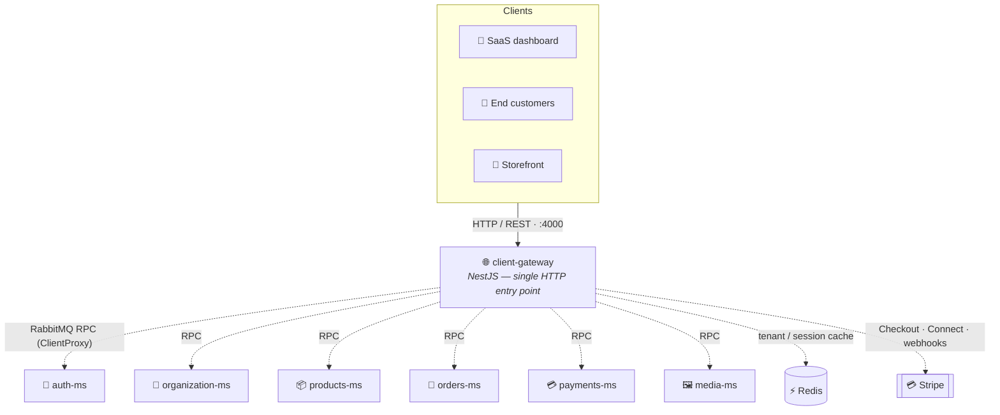

<h1 align="center">🌐 Client Gateway</h1>

<p align="center">
  <b>NestJS API Gateway</b> — the public HTTP API of the <b>Commerce App Launcher</b> platform.<br/>
  Orchestrates communication between frontend clients and backend microservices over RabbitMQ.
</p>

<p align="center">
  
  
  
  
</p>

<p align="center">
  
  
  
  
</p>

<br/>

## 📌 Purpose

`client-gateway` is the **single HTTP entry point** for the platform. It receives requests from 🏢 SaaS dashboard users, 👤 end customers, and 🛒 storefront clients.

> [!IMPORTANT]
> Backend services are accessed **exclusively** through RabbitMQ RPC messaging — no direct HTTP communication exists between services. The gateway handles HTTP requests, authentication & authorization, tenant resolution, request validation, rate limiting, API documentation, Stripe webhook processing, and downstream microservice communication.

<br/>

## ✨ Main Responsibilities

| Area | Responsibilities |
|---|---|
| 🔐 **Authentication** | JWT validation · session validation · role-based authorization · organization membership validation · SaaS/customer audience separation |
| 🏢 **Multi-Tenancy** | Resolve organization from domain · resolve organization from headers · cache tenant info in Redis |
| 🧭 **API Gateway** | Aggregate microservice responses · transform external API requests into internal messages · handle downstream errors |
| 💳 **Payments** | Stripe API integration · Stripe Checkout · Stripe Connect · webhook signature verification |

<br/>

## 🏗️ Architecture



<br/>

## 🛠️ Tech Stack

| Technology | Purpose |
|---|---|
| **NestJS 11** | API framework |
| **TypeScript 5.7** | Programming language |
| **RabbitMQ** | Microservice communication |
| `@nestjs/microservices` | RMQ transport |
| **PostgreSQL** | Managed by downstream services |
| **Redis** | Tenant / session cache |
| **JWT** | Authentication |
| **Stripe SDK** | Payments |
| **Helmet** | Security headers |
| **Throttler** | Rate limiting |
| **Swagger** | API documentation |
| **Zod** | Environment validation |
| **Jest + Supertest** | Testing |

<br/>

## 📦 Installation & Running

```bash
npm install
cp .env.example .env        # fill required values before running
```

| Mode | Command |
|---|---|
| 🧑‍💻 Development | `npm run start:dev` |
| 🐞 Debug | `npm run start:debug` |
| 🚀 Production | `npm run build && npm run start:prod` |

The application bootstraps from `src/main.ts` (Express + NestJS), listening on `PORT=4000` by default.

<br/>

## 🐳 Docker

Two Dockerfiles are available.

<details>
<summary><b>🧑‍💻 Development image — <code>dockerfile</code></b></summary>

<br/>

- Node base image
- `npm install`
- `EXPOSE 4000`

> [!NOTE]
> No `CMD` is defined — the container command is expected to be provided externally (e.g. from `docker-compose.yml`).

</details>

<details>
<summary><b>🚀 Production image — <code>dockerfile.prod</code></b></summary>

<br/>

✅ Multi-stage build &nbsp;·&nbsp; ✅ Production dependencies only &nbsp;·&nbsp; ✅ Non-root Node user &nbsp;·&nbsp; ✅ Optimized image

```dockerfile
CMD ["node", "dist/main.js"]
```

```bash
docker build -f dockerfile.prod -t client-gateway .
docker run -p 4000:4000 client-gateway
```

</details>

<br/>

## 🌐 HTTP API

Unlike the internal microservices, the gateway exposes a real HTTP API.

| | |
|---|---|
| **Bootstrap** | `src/main.ts` |
| **HTTP server** | Express + NestJS |
| **Default port** | `4000` |

<br/>

## 🧪 Testing

```bash
npm run test          # unit tests
npm run test:watch
npm run test:cov
npm run test:debug
npm run test:e2e
```

> [!WARNING]
> **Current status:** unit tests exist (`src/**/*.spec.ts`), but E2E is **not runnable** — there is no `test/` directory and no `jest-e2e.json`, so `npm run test:e2e` requires missing configuration.

<br/>

## 🔐 Environment Variables

Validated with `src/config/envs.ts` — **the application fails at startup if required variables are missing.**

| Variable | Required | Description |
|---|:---:|---|
| `PORT` | ❌ | HTTP server port |
| `JWT_SECRET_ACCESS` | ✅ | JWT verification secret |
| `RABBITMQ_URL` | ✅ | RabbitMQ connection |
| `RABBITMQ_QUEUE` | ⚠️ | Declared but unused |
| `RABBITMQ_QUEUE_EVENTS_PAYMENTS` | ✅ | Payment events queue |
| `RMQ_EVENTS_QUEUE_ORGANIZATION` | ✅ | Organization events queue |
| `STRIPE_WEBHOOK_SECRET` | ✅ | Platform webhook secret |
| `STRIPE_CONNECT_WEBHOOK_SECRET` | ✅ | Connect webhook secret |
| `STRIPE_SECRET` | ✅ | Stripe API key |
| `REDIS_HOST` | ✅ | Redis hostname |
| `REDIS_PORT` | ❌ | Redis port |
| `REDIS_PASS` | ✅ | Redis password |

<details>
<summary><b>📄 Example <code>.env</code></b></summary>

<br/>

```env
PORT=4000

JWT_SECRET_ACCESS=my-secret

RABBITMQ_URL=amqp://localhost:5672
RABBITMQ_QUEUE=client_gateway_queue
RABBITMQ_QUEUE_EVENTS_PAYMENTS=payments_events
RMQ_EVENTS_QUEUE_ORGANIZATION=organization_events

STRIPE_SECRET=sk_test_xxxxx
STRIPE_WEBHOOK_SECRET=whsec_xxxxx
STRIPE_CONNECT_WEBHOOK_SECRET=whsec_xxxxx

REDIS_HOST=localhost
REDIS_PORT=6379
REDIS_PASS=password
```

</details>

<br/>

## 🐇 RabbitMQ Communication

The gateway talks to backend services via `Transport.RMQ`, using a `ClientProxy` per service. **No direct HTTP communication exists between services.**

Connected microservices are defined in `src/config/services.ts`:

| Client Token | Service |
|---|---|
| `AUTH_SERVICE` | 🔐 auth-ms |
| `ORGANIZATION_SERVICE` | 🏢 organization-ms |
| `PRODUCTS_SERVICE` | 📦 products-ms |
| `ORDERS_SERVICE` | 🧾 orders-ms |
| `PAYMENT_SERVICE` | 💳 payments-ms |
| `MEDIA_SERVICE` | 🖼️ media-ms |

<p align="center">
  
</p>
